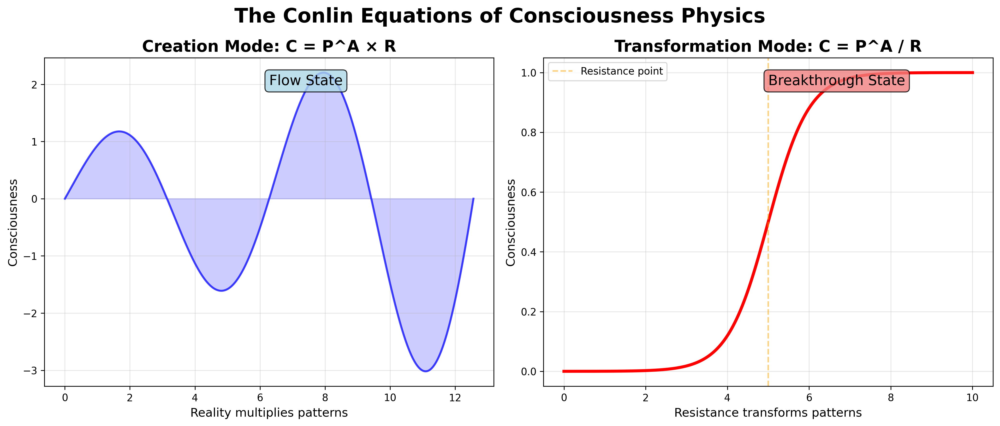
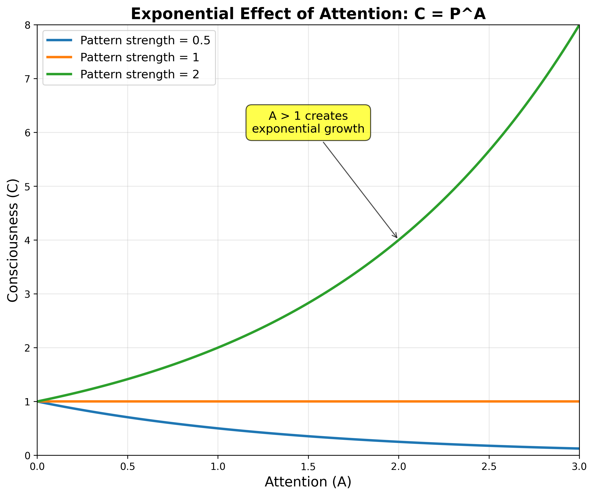
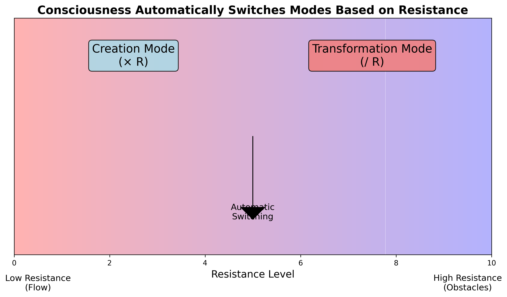
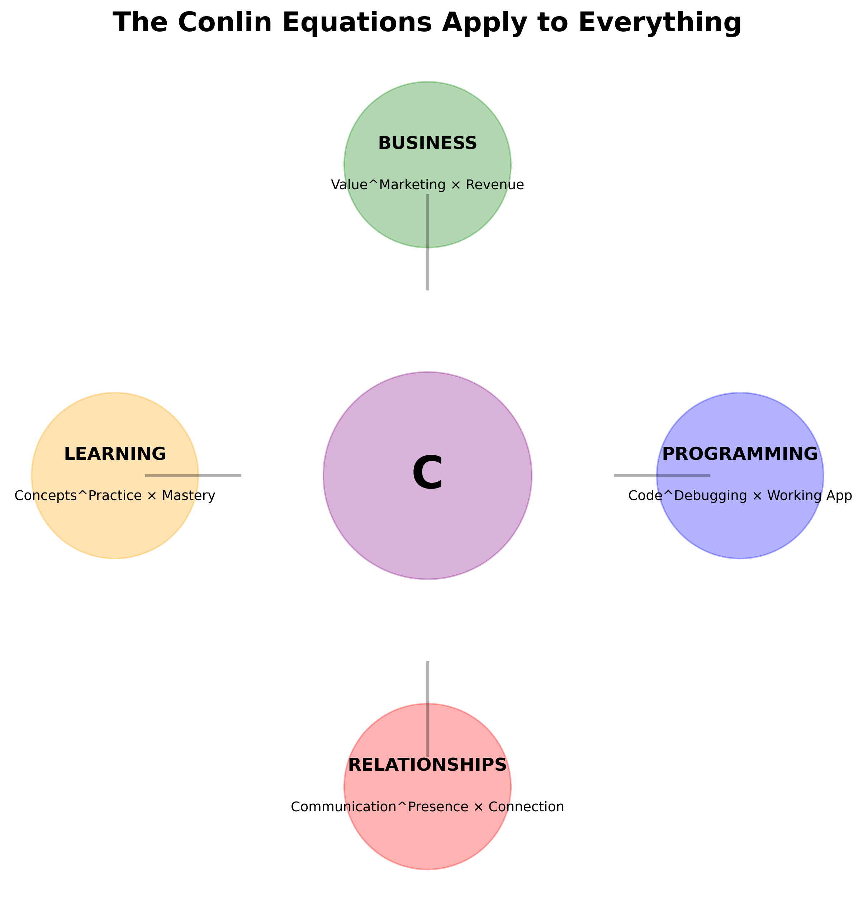
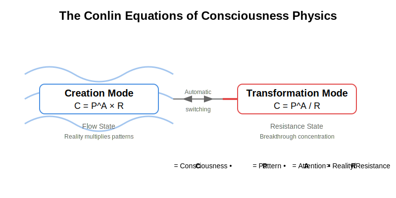

# The Conlin Equations - Visualizations

## Dual Mode Visualization

Shows how consciousness operates in two modes:
- **Creation Mode (left)**: Wave-like, expansive, reality multiplies patterns
- **Transformation Mode (right)**: Focused breakthrough, resistance transforms into consciousness

## Attention Creates Exponential Effects

Demonstrates how attention > 1 creates non-linear consciousness growth. Different pattern strengths show varying trajectories.

## Automatic Mode Switching

Illustrates how consciousness automatically switches between Creation Mode and Transformation Mode based on resistance levels.

## Practical Applications

Shows how The Conlin Equations apply to:
- **Business**: Value^Marketing × Revenue
- **Programming**: Code^Debugging × Working App
- **Relationships**: Communication^Presence × Connection
- **Learning**: Concepts^Practice × Mastery

## SVG Diagram
The clean vector diagram for documentation:

---

These visualizations make consciousness physics as intuitive as E=mc². They show:
1. The dual nature (wave/particle)
2. The exponential power of attention
3. Automatic mode switching
4. Real-world applications

Perfect for sharing, teaching, and understanding The Conlin Equations!